# 这是数值分析，数学

## 一些数学方法的程序化实现

https://github.com/brightendavid/html_calculations

这个仓库还不够完善啊

* 我看出来了，我的笔记做得有点小问题，太过自由主义

# 误差分析

* 绝对误差,e(x*)

$$
s = x^* -x
$$

* 相对误差,符号为

  
  $$
  er(x^*)
  $$
  其中，x*为真实值，x为观测值

  
  $$
  s = (x^* -x)/x=dx/x
  $$

  ## 性质

  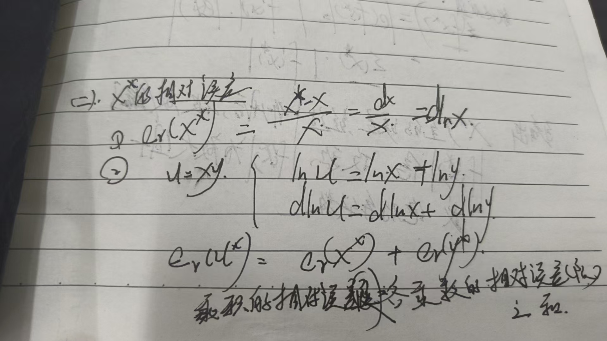

* 乘积的相对误差限是各乘数的和

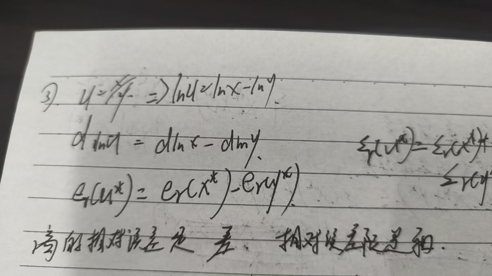

* 商的相对误差是两个变量的相对误差的差；相对误差限是和
* 进而，无论乘除，相对误差限都是和

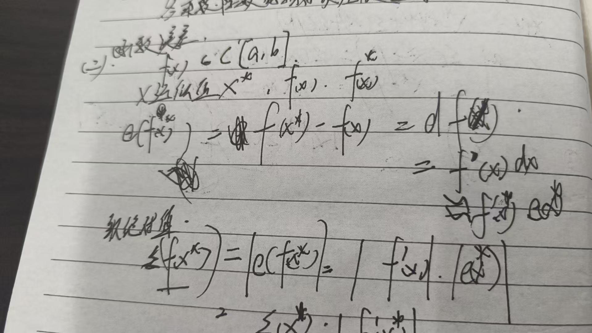

* 变量经过函数f的误差，相当于被放缩了|f'|倍。注意，这里是e，不是er。是绝对误差
* er(x)和er(f(x))的转换公式

$$
er(f(x^*)) =e(f(x))/f(x)=(e(x^*)*f'(x^*))/f(x)=(x^**f'(x^*))/f(x)*er(x^*)
$$

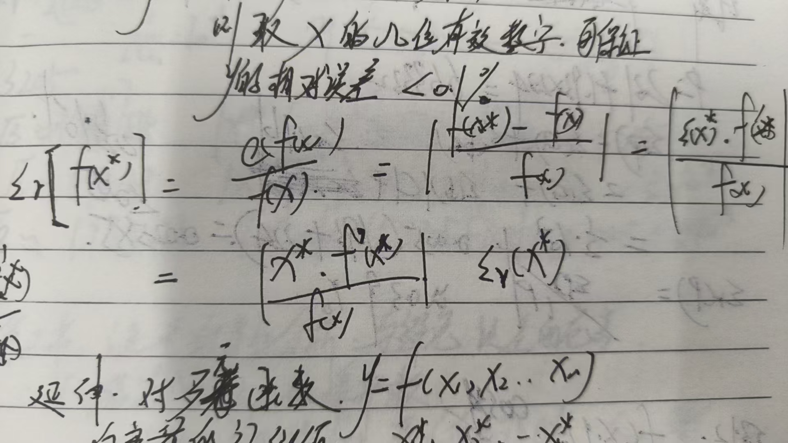

* 扩展到多元函数和f的换算。**绝对误差是偏导*变量误差的和。**

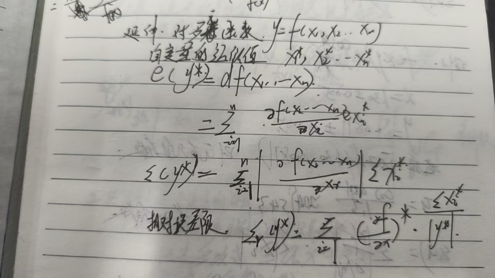

> [!TIP]
>
> 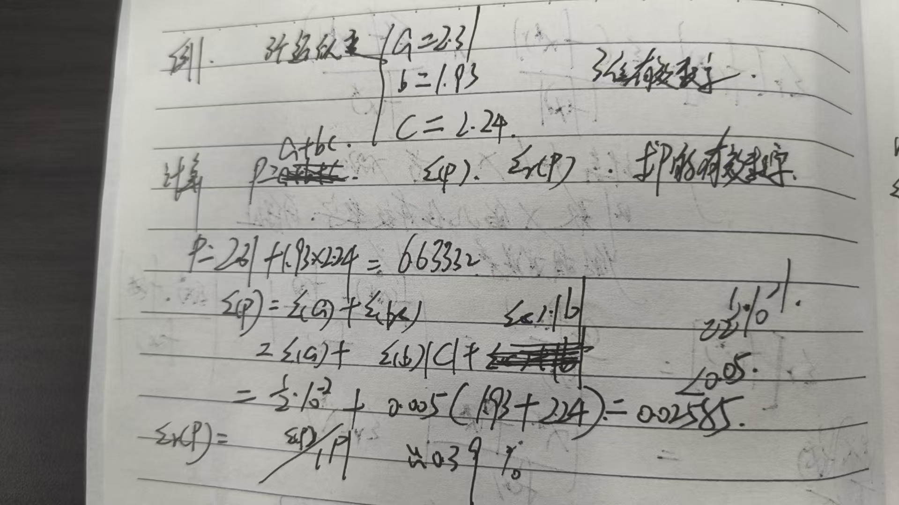

## 误差的定性分析

病态问题和条件数
$$
er(y)/er(x)= (f-f^*)/f(x) / (detail x)/(x) = (x*f')/f(x)=条件数Cp
$$

* 避免两个相近的数相减

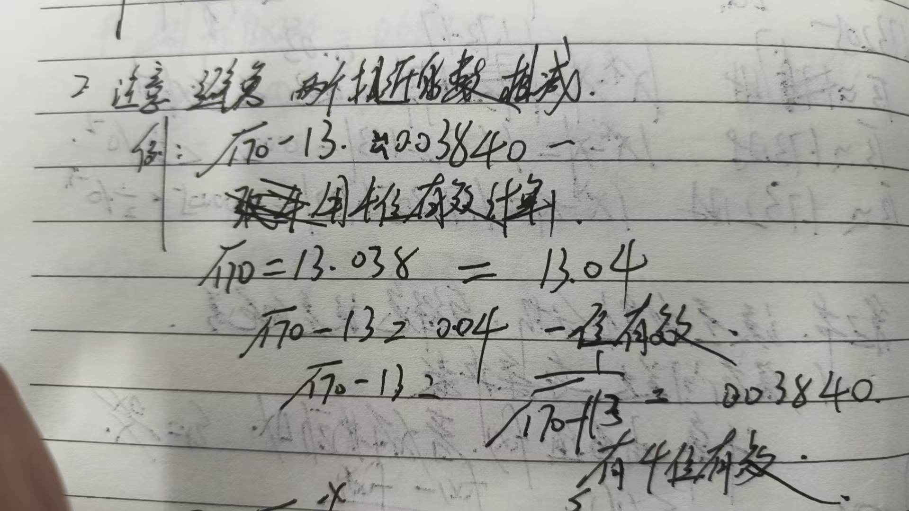

因为两个相近的数相减会把大的有效位去掉，解决方案是减法换加法

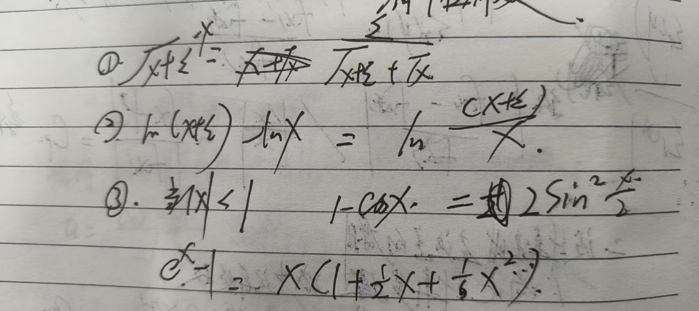

在计算过程中有这样几种运算，导致了相近的数相减。可以采用泰勒展开，或者其他手法把减法转化掉
$$
\sqrt{x-\varepsilon } -x,ln(x+\varepsilon)-ln(x)
$$

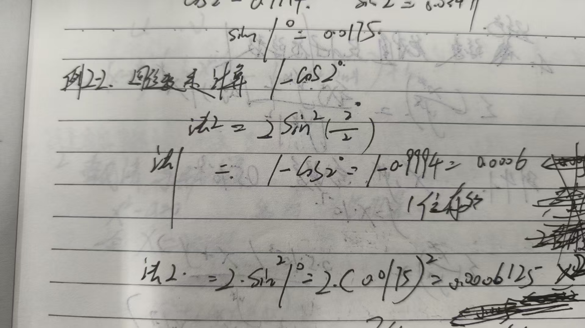

使用法1和法2得到的精确位数不一样

* 防止大数吃小数。这个在计算机的运算上可以感受到。确定精确位数的计算机，5位有效位，50000+0.1=50000

* 避免除数的绝对值远小于被除数的绝对值,误差会被y*y放大很多倍

$$
e(x/y) = (x/y)'= (e(x)y+e(y)x)/y^2
$$

## 使用稳定的算法

* 多项式求解过程中使用秦九昭算法。秦九韶算法在数值计算中具有较好的稳定性，主要因为它能有效减少运算次数，从而降低舍入误差的积累。运算数是比直接计算要少很多的，可以减少计算过程中带来的误差递增效应。

$$
P(x)=a2*x(x(a1x+b1))+b2...
$$

* 迭代法求解开方运算。这样迭代过一遍会更加接近真实值

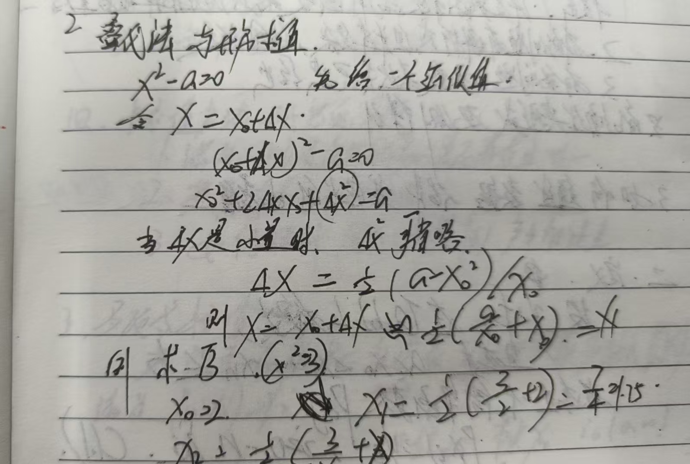
$$
x* =x+\triangle x
$$

$$
\triangle x = (a-x^2)/(2x)
$$

$$
x= x+\triangle x=x+ (a-x^2)/(2x)
$$

* 以整化零，以直代曲。这主要还是微分或者说几何的思想。

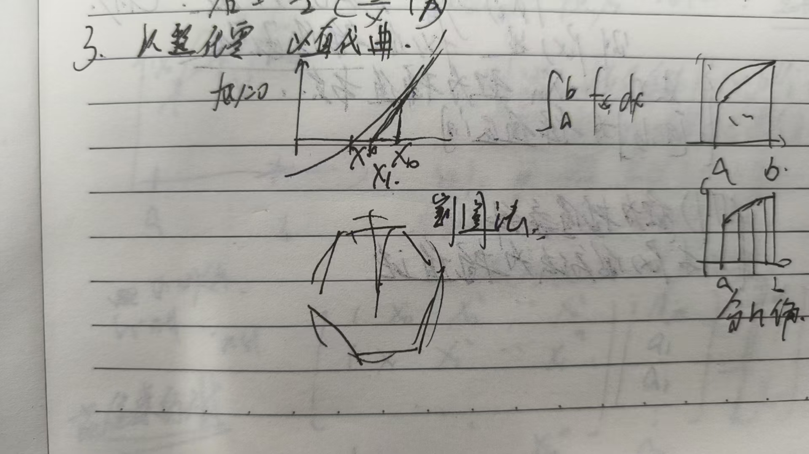

# 插值法

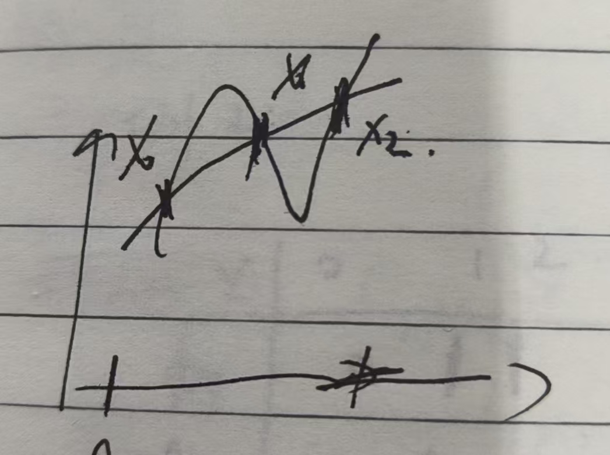

解决构造严格经过n个点的函数问题。可以采用拉格朗日插值法，牛顿插值法。

## 定义

> [!NOTE]
>
> 如果是熟悉数学史，科学史的朋友可能知道，这样定义的数学语言，车轱辘话是为了精确表述这个概念的无奈之举，最初这个数学概念的定义是非常通俗的，例如定义一个连续的函数，最初的定义是“笔不离开纸就是连续函数”。这样的大白话确实是说人话了，但是不准确。所以定义是非常重要的。

$$
设y=f(x)在[a,b]上有定义，且存在a<=x0<x1<...<xn<=b,，且存在一个简单函数P(x),P(xi)=yi,(i=0,1,...n)(1.1).其中，点x0,x1...称为插值节点，[a,b]称为插值区间。(1.1)称为插值条件，求P(x)的方法称为插值法。
$$

## 使用多项式插值法

$$
即使用x,x^2,x^3等x的幂次对原函数进行拟合。P(x)=a0+a1x+a2x^2...+anx^n
$$

* 可以通过反证法证明，若插值节点i[0,n]互异，则次数不超过n的多项式存在且唯一。
* n+1个条件确定了n+1个未知数ai,i[0,n]
* 若不规定次数不超过n,则可能有多个解
* 可通过朴素的待定系数法去解方程，求得ai的数值。就是n+1个方程求n+1个未知数的问题。条件可能是导数。

## 拉格朗日插值法

> [!IMPORTANT]
>
> 这个方法的基本思想就是构造基函数，和一些中国剩余定理里面的模运算的基向量的思想是一致的。

构造基函数li(xj)使得其满足以下性质
$$
\begin{array}{l} 
  \left\{\begin{matrix} 
  li(x_j)=1(i=j) \\ 
  li(x_j)=0(i!=j)
\end{matrix}\right.    
\end{array}
$$
使用矩阵描述就是一个（n,n）的单位矩阵。
$$
\begin{bmatrix}
1  & & \\
  & 1 & \\
  &  &1
\end{bmatrix}
$$
在图像上，li(x)表现为，在i!=j，严格穿过(xj,0)，在i点,严格穿过(xi,yi)。就可以通过这些li函数的线性叠加构造满足条件的函数L了。
$$
li(xi)=A(x-x_0)(x-x_1)(x-x_2)...(x-x_n)/(x-x_i),即,里面没有(x-x_i)这一项
$$

$$
要使得li(xi)=1,则A =(xi-x_0)(xi-x_1)(xi-x_2)...(xi-x_n)
$$

<section>
 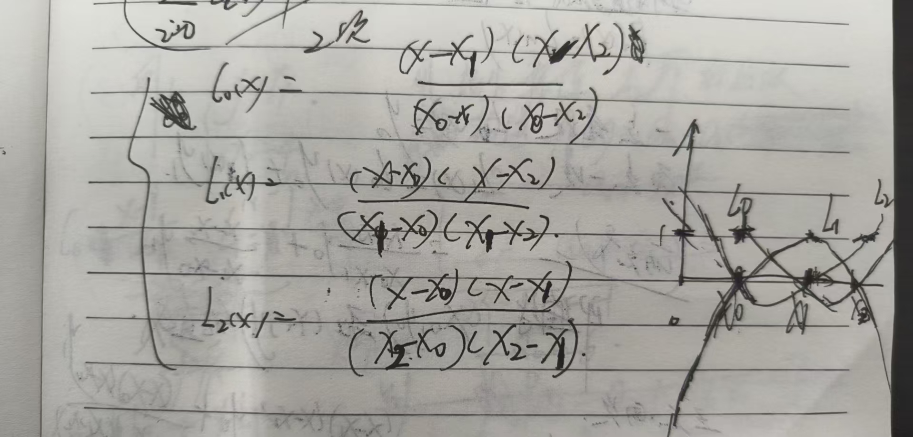</img>
 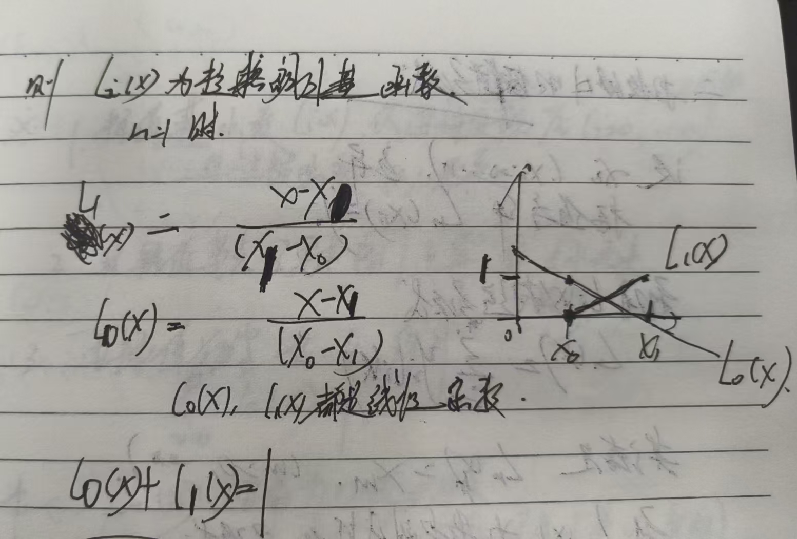</img>
</section>

如图所示，拉格朗日插值法就是这样多个基函数的线性组合,这个和余弦波的叠加是类似的
$$
L(x) =\sum_{i=0}^{n} y_i*l_i(x)
$$
由于基函数li(x)的性质，所以，满足性质
$$
L(x_m) = y_m
$$

> [!CAUTION]
>
> 请注意，这个方法本质上还是在做一个穿线的工作，一切都要围绕穿线来思考。例如：
>
> * 可以直接使用点斜式、两点式来表示出两点的方程
> * 三点一定是一个抛物线，或者抛物线的退化形式
> * 可以通过“插值多项式的唯一性”构造一个穿线的函数来证明一些性质

### 性质

* 无关性：基函数li(x)只和插值节点xi有关，和yi,被插函数f(x)无关。（这个性质还是比较好用的）

* 唯一性：构造一个y=1的直线，在上面取点，可以构造L(x)。由插值多项式的唯一性可以证明，可以通过特例获得一个普适的推论。

$$
L(x) =\sum_{i=0}^{n} l_i(x)=1
$$

* Ln(x)通常为n次多项式，特殊情况下可能小于n（共线导致的函数退化）

* 拉格朗日余项，n+1就是用到的插值节点的数量。这个余项对于之后的牛顿插值法也是相同的。请注意各项的下标，Rn是对Ln做误差估计，其他均为n+1.

$$
R_n(x)=f(x)-L_n(x)=f^{(n+1)}(\varepsilon)/（n+1）!*w_{n+1}(x)
$$

$$
w_{n+1}(x)=\prod_{0}^{n}(x-x_i)
$$

$$
对于\varepsilon,\varepsilon\in [a,b],可以采用取最大值的方式，得到一个误差的最大值，做一个不等式。这只是一个估计而已，在牛顿插值法里面可以用n+1阶查分估计它。
$$

可以通过罗尔中值定理证明，因为误差项肯定是带有w(n+1)这一项的。

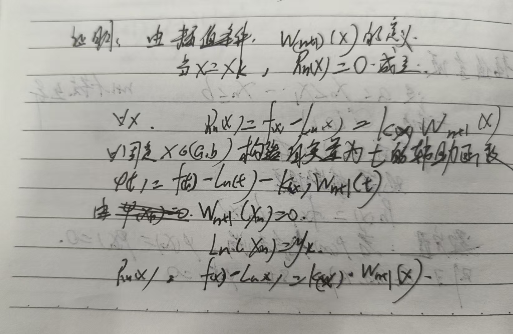

φ函数有n+2个零点，即由n+1阶导数，再求n+1阶导数即可。

* 由于误差R是n+1阶导数这个性质，所以对于x的k阶幂，k<n+1，R=0，估计是无偏的。所以x的k阶幂采用拉格朗日插值法做，就是原值。

* 名词解释：线性插值就是拉格朗日一次插值，二次插值就是拉格朗日二次插值。不是什么多项式插值。

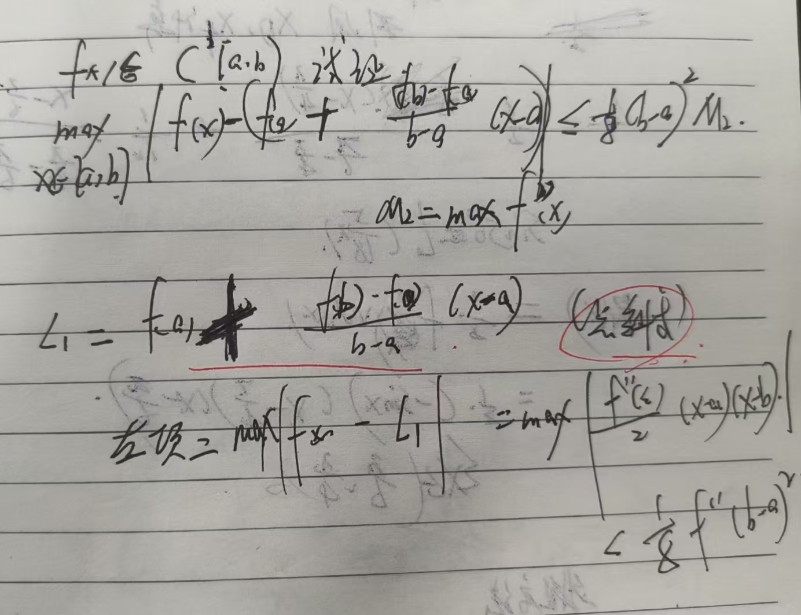

所以说，思路打开，拉格朗日插值法和之前的直接给它拟合到一个函数是共用的。

## 差商和牛顿插值

### 差商

$$
f[x0,x1]=(f(x0)-f(x1)) /(x0-x1)
$$

差商可以继续向下定义，
$$
f[x0,x1,...,xn]=(f[x0,x1...,x_{n-1}]-f[x1,x2,...x_{n}])/(x_0-x_{n})
$$
n阶差商可以由n-1阶差商定义，计算。可以通过构造插商表辅助计算。

|      | f    | 一阶     | 二阶        | 三阶 |
| ---- | ---- | -------- | ----------- | ---- |
| x0   | fx0  | f[x0,x1] | f[x0,x1,x2] |      |
| x1   | fx1  | f[x1,x2] |             |      |
| x2   | fx2  |          |             |      |

#### 性质

* 差商可以表示为函数值的线性组合，可以通过数学归纳法证明

$$
f[x0,x1,..,xn]=\sum_{k=0}^{n}\frac{f(x_{k})}{\prod_{i=0}^{n}  (x_{k}-x_i)}
$$

* 差商和节点的排列词序无关
* 通过拉格朗日中值定理可证，

$$
f[x0,x1...,xn]=\frac{ f^{(n)}(\varepsilon )}{n!}
$$

* 若f(x)是n次多项式，f[x0,x1...xk]是n-k次多项式。k>n时，为0次多项式

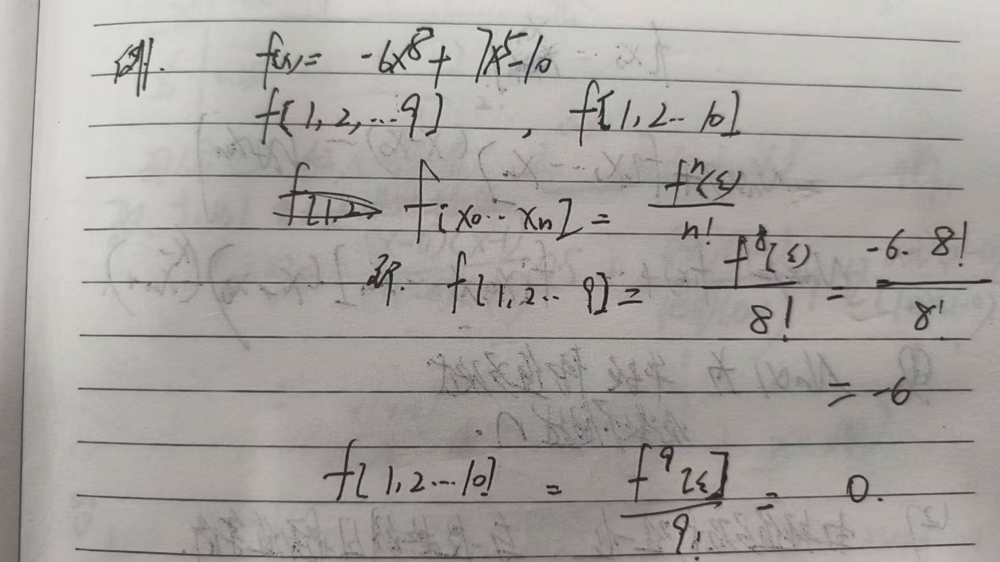

8次多项式求8阶差商，就只剩下一个系数了。求9阶差商，必然是0

### 牛顿插值法

通过对差商的一些数学变换，就可以得到牛顿插值法公式。和拉格朗日插值法相比，优点在于，新加入一个点，可以在原式基础上，通过简单的添加一项，就可以了。不需要重新再算一遍基函数。

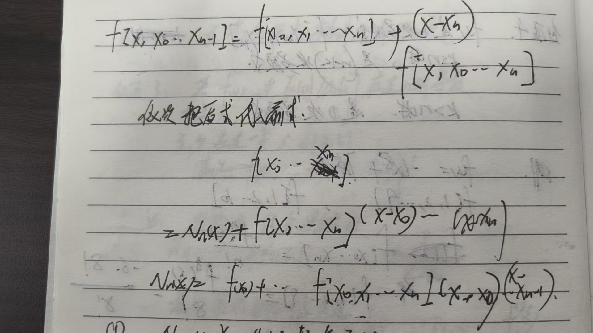

* 牛顿插值法的余项和拉格朗日插值法的余项是一致的。

$$
R_{n-1}=N_n(x) -N_{n-1}(x)=f[x0,x1,...x_n](x-x0)(x-x1)...(x-x_{n-1})
$$

$$
f[x0,x1...,xn]=\frac{ f^{(n)}(\varepsilon )}{n!}
$$

得到的余项是相同的。上式，计算的是R(n-1),所以才是n啊，不要搞错了。

Rn的余项，下面的参数全部是n+1,w也是n+1次多项，本质上就是对下一项的近似。
$$
R_{n}=N_{n+1}(x) -N_{n}(x)=\frac{f^{(n+1)}(\varepsilon)}{(n+1)!}(x-x0)(x-x1)...(x-x_n)=\frac{f^{n+1}(\varepsilon)}{(n+1)!}w_{n+1}
$$
和上面拉格朗日余项是相同的

### 前插和后插

定义符号：y=f(x)在**等距节点**xi
$$
xi=x0+ih
$$

$$
fi=f(x_i)
$$

定义运算，前插后插
$$
\nabla fi = f_{i}-f_{i+1},\triangle f_i=f_{i+1}-f_{i}
$$

$$
\triangle ^2f_i=\triangle f_{i+1} -\triangle f_{i}
$$

| 节点 | 函数值 | 一阶    | 二阶          | 三阶          |
| ---- | ------ | ------- | ------------- | ------------- |
| x0   | f0     | △f0,▽f1 | △f^2 0,▽f^2 2 | △f^3 0,▽f^3 3 |
| x1   | f1     | △f1,▽f2 | △f^2 1,▽f^2 3 |               |
| x2   | f2     | △f2,▽f3 |               |               |
| x3   | f3     |         |               |               |

#### 性质

* 代换性

$$
\nabla^{m} f_{i+m} = \triangle^{m} f_i
$$

* 分配率

$$
\triangle (a*f(x)+b*g(x))=a *\triangle f(x)+b*\triangle g(x)
$$

* 差分值可用函数值得到

$$
\triangle^{n} f_i = \sum_{j=0}^{n} (-1)^j \binom{j}{n}f_{n+i-j}
$$

$$
\nabla^{n} f_i = \sum_{j=0}^{n} (-1)^{n-j}\binom{j}{n}f_{-n+i+j}
$$

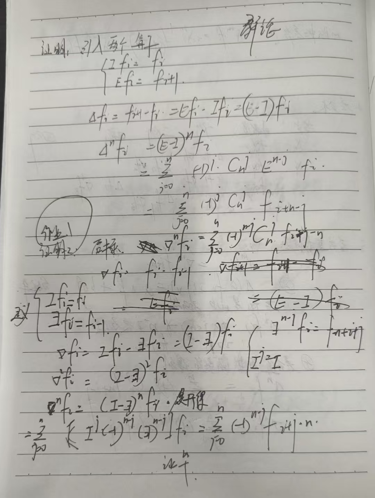

证明思路就是定义两个新运算，我一直觉得这个需要结合群论里面的知识来做，要证明它的结合律和分配率。

定义I运算是返回输入，E运算是返回f(i+1),这样做的好处就是可以使用结合律了。

* 函数值可以用差分值算出

$$
f[x_{i},x_{i+1},...x_{i+m}]=\frac{1}{m!h^m} \triangle^{m} f_i
$$

$$
f[x_{i},x_{i-1},...x_{i-m}]=\frac{1}{m!h^m} \nabla ^{m} f_i 
$$

每做一阶差分，就除以差值h,所以是h^m;每做一阶差分，就是n-1阶差分的差分，间隔为n,所以是m!。

这个用定义可以简单证明，或许还需要归纳法

* 函数值-差分值-差商 有转换关系

$$
f[x_{i},x_{i+1},...x_{i+m}]=\frac{1}{m!h^m} \triangle^{m} f_i = \frac {f^{m}(\varepsilon )}{m!},i=0
$$

将差商带入原牛顿插值法构造函数可以得到
$$
Nn(x)=Nn(x0+th)=f(x_0)+\triangle f_0*t+\frac {\triangle^2f_0}{2!}(t)(t-1)...+\frac {\triangle^{n}f_0}{n!}(t)(t-1)...(t-n+1)
$$

$$
Rn(x)=Rn(x0+th)=\frac{f^{n+1}}{(n+1)!}h^{n+1}t*(t-1)...(t-n)
$$

## 艾尔米特插值

没那么多花里胡哨的，按照特殊的牛顿差值来做就行了。把导数看做是一个重节点，就是x+dx，一个无穷小量构造插值表

当x0=x1=x2...=xn。

什么同时含有导数和函数值的情况，有一个很复杂的公式什么的，我感觉没有必要记。
$$
f[x0,x1]=f'(x0)
$$

$$
f[x0,x1,x2]=f''/2!
$$

$$
f[x0,x1,x2...,xn]=\frac{f^{(n)}(x0)}{n!}
$$

##  分段低次插值

### 龙格现象

高次情况下误差会累加。适当提高次数可以提高逼近的精度，但是次数太高，可能产生不良后果。n越大，可能会在断点附近剧烈抖动，“龙格现象”

那么就分小区间，在小区间内进行低次的插值——分段插值思想。

### 分段线性插值

这就是拉格朗日插值，或者说直线的两点式写法。

注意区间

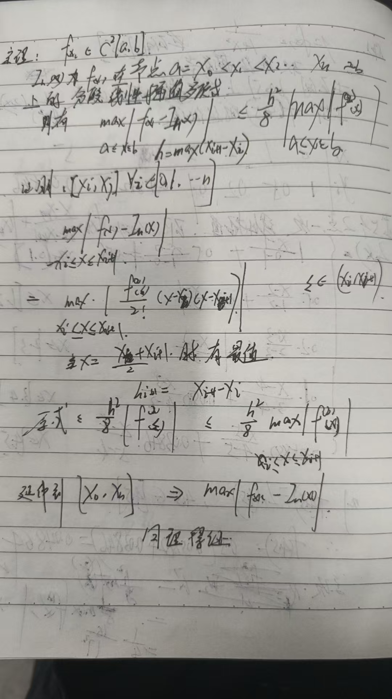

#### 误差分析

$$
max(|f(x)-In(x)|)<=\frac{h^2}{8}f^{(2)}(\varepsilon)
$$

### 分段三次埃尔米特H插值

还是按照牛顿插值法的来，花里胡哨的
$$
max(|f(x)-In(x)|)<=\frac{h^4}{384}f^{(4)}(\varepsilon)=\frac{h^4}{4!*2^4}f^{(4)}(\varepsilon)
$$

$$
h=max(x_{i+1}-x_{i})
$$

## 样条差值

函数S(x)满足

* 三次多项式
* a<x0<x1<...xn<b,n+1个点
* 内节点有2阶连续导数

则S(x)是上述划分的一个三次多项式的样条函数

* 三次多项式在[xi,xi+1]是三次多项式，那么一个区间4个待定系数，有n个区间，需要4n个系数，就需要4n个条件
* 内节点有2阶连续导数，内节点有n-1个,除了x0和xn：

$$
s(x-0)=s(x+0),s'(x-0)=s'(x+0),s''(x-0)=s''(x+0)
$$

那么就有3(n-1)个条件了

* s(xi)=yi,这里是n+1个条件。总计4n-2个条件
* 剩下两个条件通过边界条件给出

# 函数逼近

## 定义

### 线性空间

* Rn：n维向量空间
* Hn：多项式
* C[a,b]连续函数
* R n*n 矩阵

### 魏尔斯特拉斯逼近定理

> [!NOTE]
>
> 这个定理实际上是在关于无穷小dx的讨论中提出的。闭区间的连续函数可用多项式一致逼近

$$
\forall \varepsilon >0,\exists P(x)\in H_n,s.t. |f(x)-P_m(x)|<\varepsilon,\forall x \in[a,b]
$$

### 范数

定义S为线性空间，x属于S，若存在唯一实数||.||。满足

* 正定性：||x||>=0,x=0取0
* 齐次性：||ax||=|a|.||x||
* 三角不等式：||x+y||<=||x||+||y||

则称||.||是S上的范数

#### 向量范数

* 1范数：绝对值求和
* 2范数：平方求和，开方
* 无穷范数：取最大值

可以用于积分，和离散求和

### 内积

$$
\begin{align*}
 \\x =(x1,x2,x3...)^T
 \\y= (y1,y2,y3...)^T
 \\(x,y)=\sum w_ix_iy_i
\end{align*}
$$

也可以定义加权内积，wi.

#### 性质

* 交换律：(f,g) =(g,f)
* 分配率：(cf,g)=c(f,g))
* 分配率：(f1+f2,g)=(f1,g)+(f2,g)
* 保号性：(f,f)>=0

#### 定理

$$
\begin{align*}
 \\|(f,g)|<=\sqrt{(f,f)(g,g)}=||f||_2+||g||_2 柯西定律
 \\||(f+g)^2_2||<=(||f||_2+||g||_2)^2三角不等式定律
 \\||f+g||_2^2+||f-g||^2_2=2(||f||_2^2+||g||_2^2) 平行四边形定律
\end{align*}
$$

证明如下：

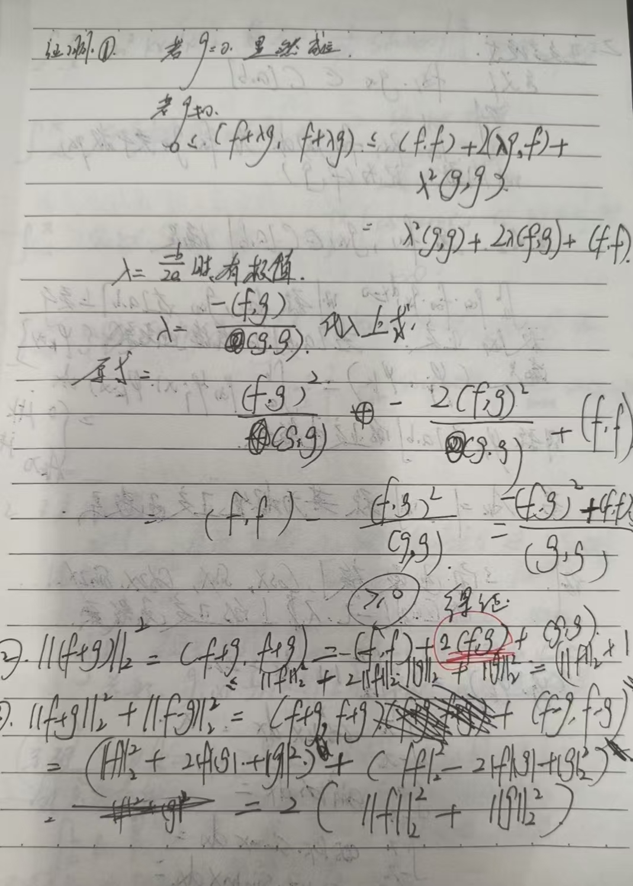

### 正交多项式

正交性就是内积为0，自内积为正数
$$
\int_{b}^{a}p(x)f(x)g(x) dx=0
$$
则称f,g在[a,b]上关于权重p(x)正交。若[a,b]上连续函数系φk(x)满足
$$
\begin{array}{c} 
 (\varphi j,\varphi k) =0  ,j!=k\\ 
  (\varphi j,\varphi k) =A_k  ,j==k
\end{array}
$$
则φk是[a,b]的正交函数系。若Ak=1，则φk是标准正交函数系

如三角函数族
$$
1，cosx,sinx,cos2x,sin2x...
$$
为区间[-π,π]的正交函数系。

此法也可以应用于多项式等离散情况下。

* 定理：gk(x)是正交多项式的充要条件：[a,b]上任意次数不超过k-1的多项式P（x）都有（P，gk）=0，即gk(x)和任意次数不超过(k-1)的多项式P（x）在[a,b]上都正交

对于任意的区间[a,b]均可以构造一组线性无关的函数{1,x,x^2...},利用逐个正交化过程可以构造正交多项式序列φn(x).(正交化过程)
$$
\begin{array}{c} 
 \varphi 0(x)=1 \\ 
  \varphi _n(x)=x^n-\sum^{n-1}_{j=0}\frac{(x^n,\varphi _j(x))}{\varphi_j(x),\varphi_j(x)}\varphi_j(x) 
\end{array}
$$
性质：

* 最高项次数为1的正交多项式唯一
* φn每一项线性无关
* Pn均可表示为φ0，φ1...φn的线性组合
* φk和任意次数<k的多项式正交，(φj,φk)=0

#### 递推关系，重要

正交多项式相邻三项之间存在一个递推关系
$$
\varphi_{n+1}(x)=(x-\alpha_n)\varphi_{n}(x)-\beta_n \varphi_{n-1}(x)\\
\alpha_n=\frac{(x\varphi_n,\varphi_n)}{(\varphi_n,\varphi_n)}\\
\beta_n = \frac{(\varphi_n,\varphi_n)}{(\varphi_{n-1},\varphi_{n-1})}\\
\varphi_0=1\\
\varphi_{-1}=0
$$

### 勒让德多项式Legendre

定义区间为[-1,1],所有权重p(x)=1.由{1,x,...x^n}正交化得到的多项式为勒让德多项式，用P0，P1,P2...表示。

| 多项式名称            | 定义区间     | 权函数*ω*(*x*) | 递推公式 (初始值通常为P*0=1,*P*1=*x)                 |
| :-------------------- | :----------- | :------------- | :--------------------------------------------------- |
| **勒让德 (Legendre)** | [−1,1] | 1             | (n+1)Pn+1(x)=(2*n*+1)*x**P**n*(*x*)−*n**P**n*−1(*x*) |

$$
P_0(X)=1\\
P_n(x)=\frac{1}{2^nn!} \frac{d^n(x^2-1)^n}{dx^n},n=1,2...\\
=\frac{(2n)!}{2^n(n!)^2}x^n+...
$$

#### 性质

* 正交性  = 0  ,m!=n；= 2/(2n+1), m=n
* 奇偶性

$$
P_n(-x) =(-1)^nP_n(x)
$$

* 递推线性关系

$$
(n+1)P_{n+1}=(2n+1)xP_n -nP_{n-1}\\
P0=1\\
P1=x\\
P2= \frac{3x^2-1}{2}
$$

### 最佳平方逼近（n次平方最优逼近问题）

$$
S = \int a_k* \varphi_k(x)
$$

S是φk的线性组合。
$$
I=||f(x)-S^*(x)||^2_2=min(||f(x)-S(x)||^2_2)=min(\int^b_ap(x)[f-S]^2)dx
$$
即取极值，此时，偏导=0.有
$$
\frac{\partial I}{\partial a_k} = 2\int(p(x)*(f-S)\varphi_k)dx=0
$$

$$
 \int(f)\varphi_k)dx=\int(S)\varphi_k)dx即(f,\varphi_k)=(\sum(a_i*\varphi_i,\varphi_k))
$$

注意到这个计算形式，这符合矩阵运算的形式，可以改为矩阵的形式
$$
(f,\varphi_k)=\sum_{i=0}^{n}(a_i\varphi_{i},\varphi_{k})
$$
写成矩阵形式为

#### 正规方程组

$$
\begin{bmatrix}
  (\varphi_0,\varphi_0 ) &(\varphi_0,\varphi_1 ) &...& (\varphi_0,\varphi_n )\\
  (\varphi_1,\varphi_0 ) &(\varphi_1,\varphi_1 ) &...& (\varphi_1,\varphi_n )\\
   ...& ...& ...& ...\\
  (\varphi_n,\varphi_0 ) &(\varphi_n,\varphi_1 ) &...& (\varphi_n,\varphi_n )\\
\end{bmatrix}
*
\begin{bmatrix}
  a0\\
a1\\
...\\
an
\end{bmatrix}
=
\begin{bmatrix}
(f, \varphi 0)\\
 (f,\varphi 1)\\
...\\
 (f,\varphi n)
\end{bmatrix}
$$

$$
HA=D
$$

由于H和D的数值均可以准确求出，所以，可以通过此方程组得到ak的唯一解，即求出了S(x)

φ可以取x的幂次，也可以取勒让德多项式，在计算时候数值有所不同，但这个正规方程组是通用的。

当φ取x的幂次时候，矩阵H表现形式为,若所求为n次平方逼近多项式，H=（n+1,n+1），因为有n+1个未知数。但是选取x的幂次去近似可能有方程组的病态问题。所以可以选用勒让德多项式去近似，可以解决病态问题。
$$
H=\begin{bmatrix}
 1&1/2&...,&1/(n+1)\\
 1/2&1/3&...,&1/(n+2)\\
...&...&...&...\\
 1/(n+1)&1/(n+2)&...,&1/(2n+1)
\end{bmatrix}
$$
当φ取勒让德 多项式时候，具有正交性。此时（φi,φi）=2/(2n+1)，其他根据正交性，全部为0。需要满足取值在[-1,1]
$$
H=\begin{bmatrix}
 2&0&...,&0)\\
 0&2/3&...,&0\\
...&...&...&...\\
0&0&...,&2/(2n+1)
\end{bmatrix}
$$
根据递推式，可以求得Pn的每一项表达式，同理，可以求得每一个ak,S=a0+a1*p1...+an*Pn
$$
(n+1)P_{n+1}=(2n+1)xP_n -nP_{n-1}\\
P0=1\\
P1=x\\
P2= \frac{3x^2-1}{2}
$$
当不满足x取值为[-1,1]时候，如[a,b]的取值区间，可以采取变量代换的方式换为[-1,1]的取值,这是非常基础的东西。
$$
x=\frac{a-b}{2}t+\frac{a+b}{2},t\in[-1,1],a\in[a,b]
$$

### 最小二乘拟合

给定一组点（xi,yi）(i=0,1,2...n)n+1个点。选取线性无关的函数组φ0，...φn,权函数w(x)
$$
\varphi^*(x)=\sum_{i=0}^{m} a_i*\varphi_i(x),m<=n
$$

$$
I=\sum_{i=0}^{n}[\varphi(x_i)-y_i]^2
$$
取极小值。就是偏导=0,化简
$$
(\varphi_i,y_j)=\sum_{i=0}^{n}(\varphi_j,a_i\varphi_i)
$$
等价于,这里A^TA的shape一直感觉有点怪怪的
$$
A^TAa=A^TY
$$

$$
A=\begin{bmatrix}
 \varphi_0(x0)&\varphi_1(x0)&...,&\varphi_m(x0))\\
\varphi_0(x1)&\varphi_1(x1)&...,&\varphi_m(x1))\\
...&...&...&...\\
\varphi_0(xn)&\varphi_1(xn)&...,&\varphi_m(xn))\\
\end{bmatrix},shape=(m*n)
$$

$$
A^TA,shape=(m,m)
$$

$$
Y,shape=(n,1)
$$

$$
a,shape=(m,1)
$$

引入正交多项式进行曲线拟合，就是考虑到正交性，可以速算，即使是离散型也是具有正交性的性质的

ATA就是一个对角矩阵了（m,m)

注意对于任意正交多项式都有递推式的。
$$
\varphi_{n+1}(x)=(x-\alpha_n)\varphi_{n}(x)-\beta_n \varphi_{n-1}(x)\\
\alpha_n=\frac{(x\varphi_n,\varphi_n)}{(\varphi_n,\varphi_n)}\\
\beta_n = \frac{(\varphi_n,\varphi_n)}{(\varphi_{n-1},\varphi_{n-1})}\\
\varphi_0=1\\
\varphi_{-1}=0
$$
这个计算过程感觉还挺复杂的。

